<p align="center">
  
</p>

<h1 align="center">f1-cyberdeck</h1>

<p align="center">An unattended Formula 1 live-timing kiosk for the Raspberry Pi 5.</p>

---

**f1-cyberdeck** is a fork of [f1-dash](https://github.com/slowlydev/f1-dash) re-purposed as a 24/7
**kiosk**. It runs on a Raspberry Pi 5 driving a 1366×768 display in Chromium kiosk mode and
manages the whole race weekend on its own:

- **Live mode**  real-time telemetry during a session: leaderboard with tyres, gaps, DRS and pit
  status, a GPS track map, race-control alerts, and full-screen flag indicators.
- **Idle carousel**  between sessions, an auto-rotating set of eight info panels.
- **Race-weekend arc**, fully automatic: idle carousel → 30 s pre-race countdown → live timing →
  ~90 s post-race summary → back to an updated carousel.

## Live mode

Real GPS car positions, live timing, tyre stints, gaps, and race-control messages surfaced as
corner toasts. Pitting cars are tagged on the map and the pit lane is learned from live GPS.

<p align="center">
  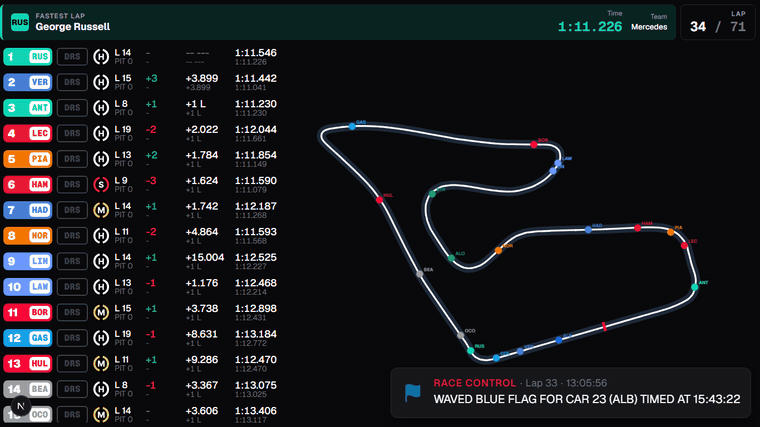
</p>

Safety Car, Virtual Safety Car, and red flag periods glow the whole screen edge. Yellow for
SC/VSC, red for a red flag so the track state is readable from across the room.

<p align="center">
  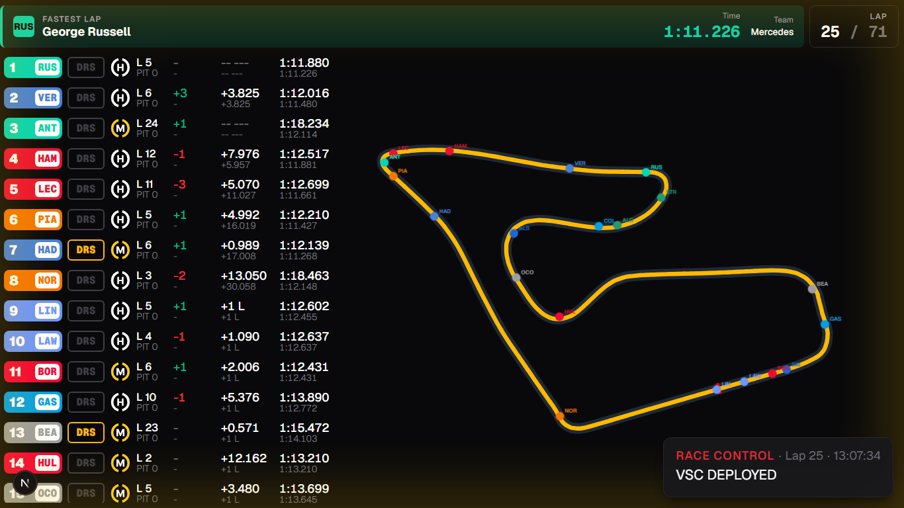
</p>

## Post-race summary

When a race ends, the final classification is snapshotted and shown for ~90 seconds: podium,
points-payers, DNFs, and the real championship swing.

<p align="center">
  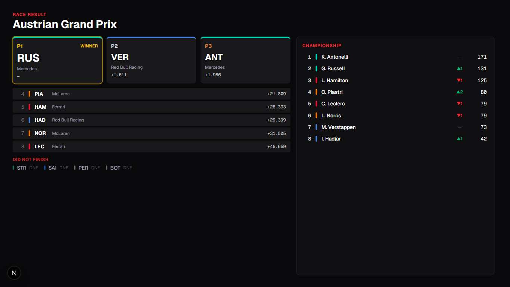
</p>

## Idle carousel

Eight panels cycle every 15 seconds while no session is running. All data is cached and degrades
gracefully when an upstream API is unreachable. The kiosk always shows something.

| Drivers' Championship | Constructors' Championship |
|---|---|
| 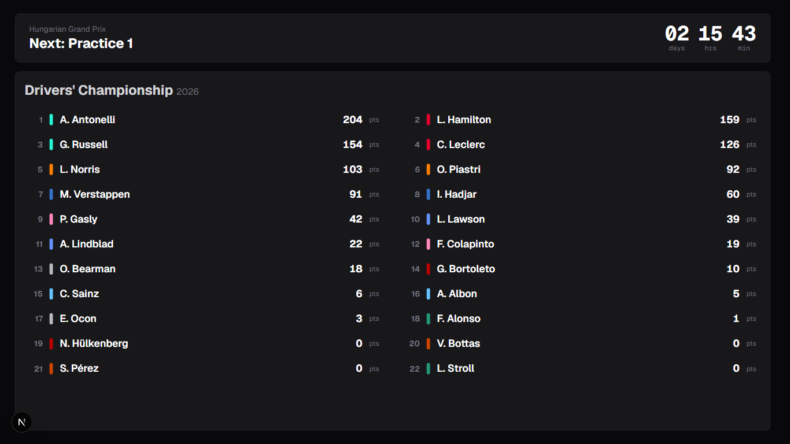 | 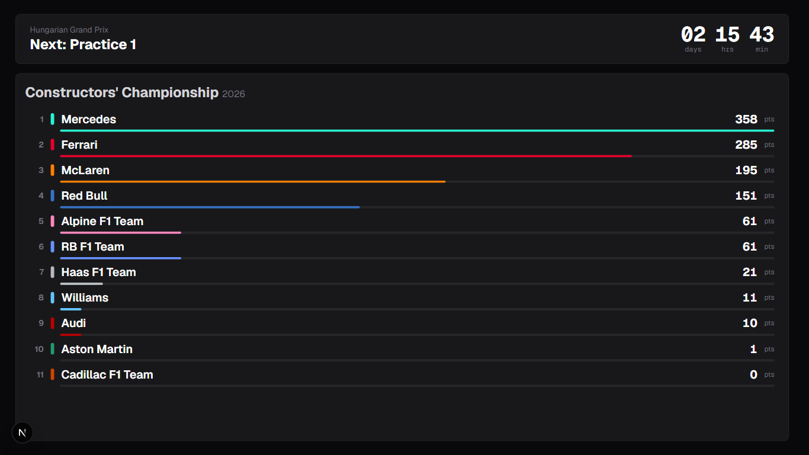 |
| **Next Race Weekend** | **Circuit & Schedule** |
| 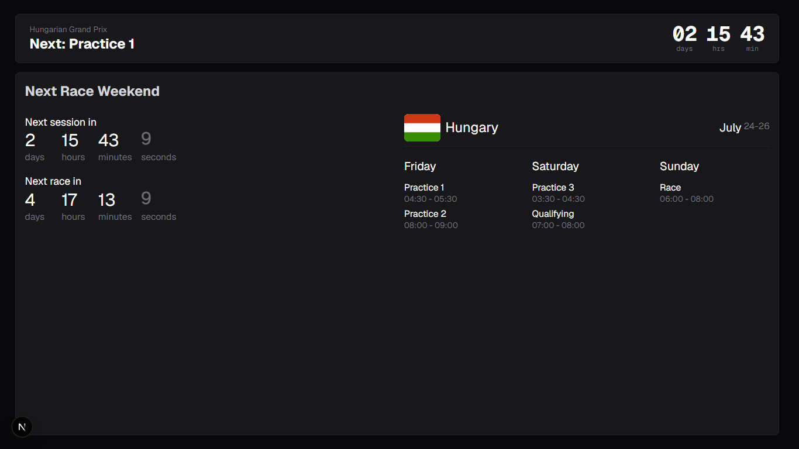 | 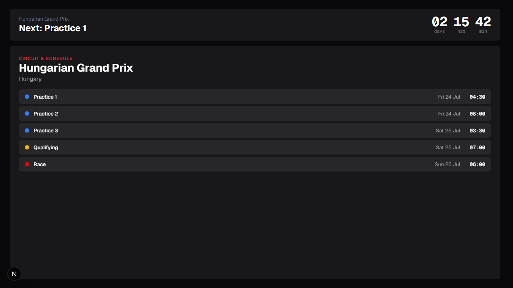 |
| **Last Race Results** | **Driver Season Stats** |
| 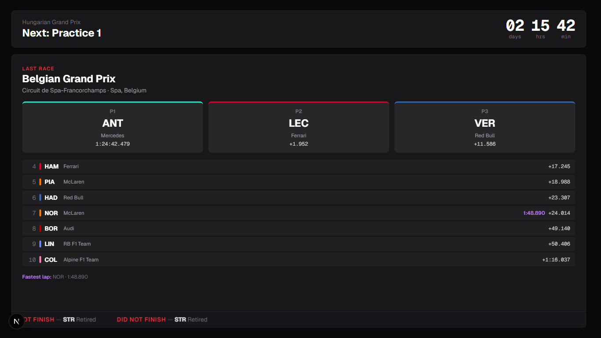 | 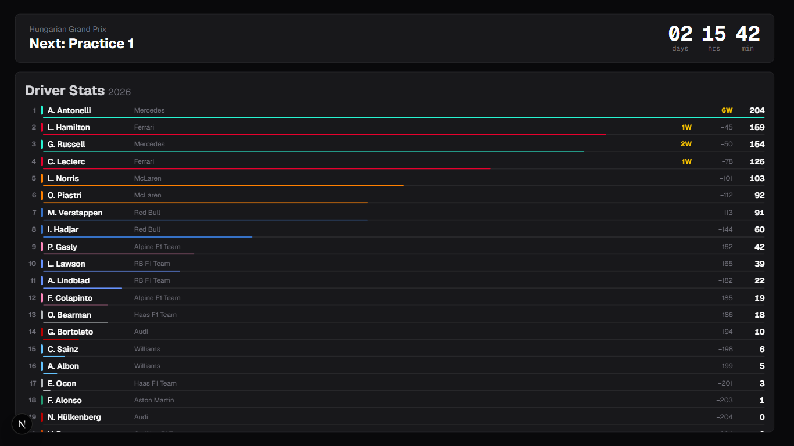 |
| **Track Map** | **Track Weather** |
| 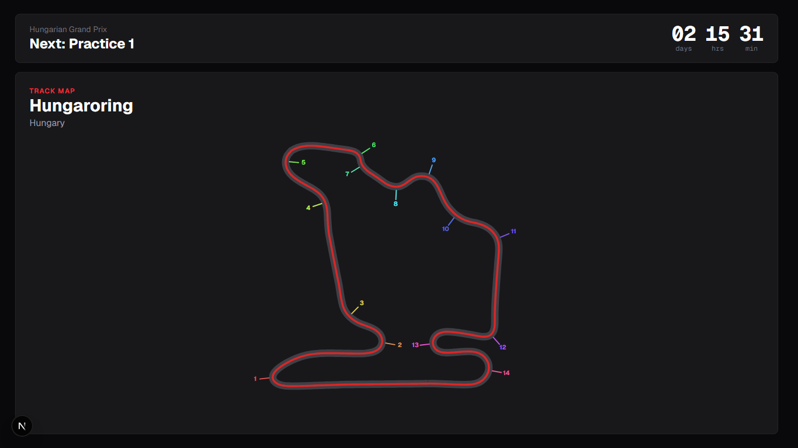 | 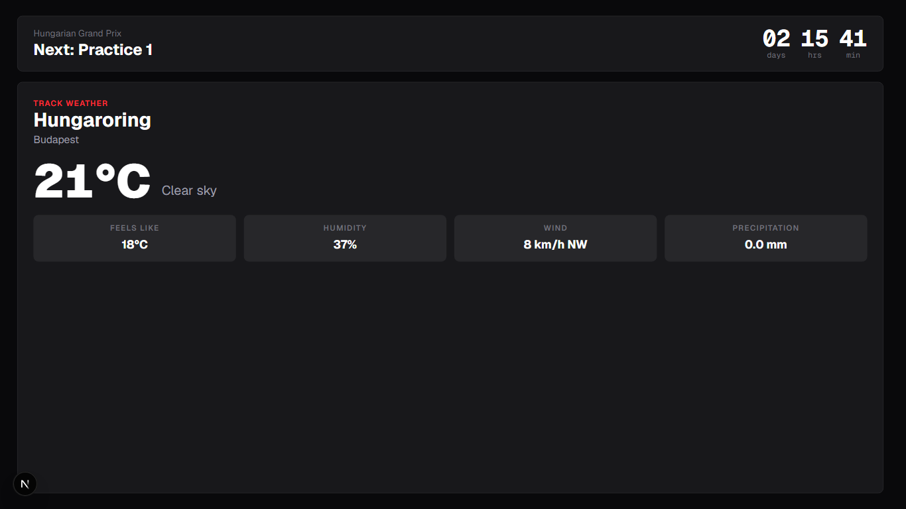 |

## Tech stack

| Layer | Tech |
|---|---|
| Dashboard | Next.js 16 (App Router, Turbopack, standalone), React 19, TypeScript |
| Styling / animation | Tailwind CSS v4, Motion |
| Live data | SSE from a local Rust `realtime` service (F1 SignalR → SSE proxy) |
| Schedule / results | [Jolpica](https://api.jolpi.ca) (Ergast-compatible) |
| Track maps | [MultiViewer](https://multiviewer.app) circuit API |
| Weather | [Open-Meteo](https://open-meteo.com) |
| Kiosk | Chromium on Raspberry Pi OS Bookworm (Wayland/labwc) |

The realtime service serves **SSE** (upstream f1-dash serves WebSockets), so everything is built
from this repo (upstream prebuilt images are incompatible.)

## Deployment

On a Raspberry Pi 5 running 64-bit Raspberry Pi OS Bookworm, with this repo at `~/f1-cyberdeck`:

```bash
bash ~/f1-cyberdeck/kiosk/install.sh   # Docker + Chromium + swap + build + autostart
sudo reboot
```

`install.sh` installs Docker and Chromium, disables screen blanking, builds all three services
(`web`, `realtime`, `api`) from source via Docker Compose, and wires up the kiosk to launch on
boot. See [`SETUP.md`](SETUP.md) for the service/environment reference and [`CLAUDE.md`](CLAUDE.md)
for architecture notes and Pi-specific gotchas.

### Copy-deploy without git

No git on the Pi? Ship a source tarball instead. From a dev machine:

```bash
bash kiosk/pack.sh                 # writes ./f1-cyberdeck.tar.gz (~1–2 MB, source only)
scp f1-cyberdeck.tar.gz pi@<pi-host>:~/
```

Then on the Pi:

```bash
mkdir -p ~/f1-cyberdeck && tar -xzf ~/f1-cyberdeck.tar.gz -C ~/f1-cyberdeck
bash ~/f1-cyberdeck/kiosk/install.sh && sudo reboot
```

`install.sh` detects a manually-copied tree (no `.git`, `compose.yaml` present) and skips the
clone. The tarball excludes `node_modules`, build output, git history and dev-only replay data; the
Pi rebuilds everything for arm64.

### Kiosk display care

Two things keep the 24/7 display healthy and legible:

- **Burn-in protection** — the whole UI slowly drifts a few pixels once a minute so no bright,
  static element (leaderboard frame, session bar) ghosts an older panel. Automatic in kiosk builds;
  imperceptible in normal viewing.
- **Readable team colours** — driver codes and the fastest-lap time are drawn in each team's real
  brand palette, contrast-checked (WCAG AA) so light liveries (Mercedes, Williams, Haas …) stay
  readable "from across the room" instead of washing out.

## Local development

```bash
cd dashboard
yarn install
yarn dev            # http://localhost:3000/dashboard
```

A dependency free mock SSE backend and a FastF1 replay player drive live mode without a real
session:

```bash
yarn mock:live      # synthetic live feed
yarn replay         # replays a real recorded race (2026 Austrian GP) over SSE
```

Dev shortcuts (query params, inert in the kiosk build): `?testCountdown=1` fakes a 35→0 pre-race
countdown; `?burnin=1` enables the pixel-shift locally (`?burnin=3` speeds it to 3 s steps so the
drift is visible).

Tests: `npx playwright test` (from `dashboard/`).

## Credits

Built on [f1-dash](https://github.com/slowlydev/f1-dash) by Slowlydev. Real-session replay uses
[FastF1](https://github.com/theOehrly/Fast-F1).

## Notice

This project is unofficial and is not associated in any way with the Formula 1 companies. F1,
FORMULA ONE, FORMULA 1, FIA FORMULA ONE WORLD CHAMPIONSHIP, GRAND PRIX and related marks are trade
marks of Formula One Licensing B.V.
